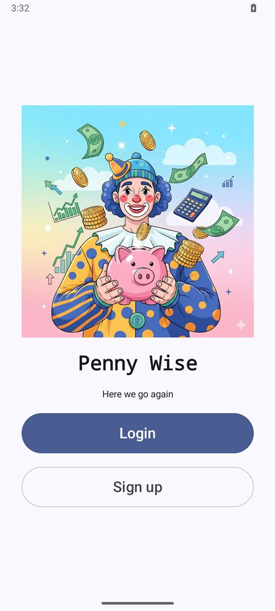

<p align="center">
  
</p>

# Penny Wise: Personal Budgeting App for Android

    [](https://github.com/Letlhogonolo-Kgatshe/penny-wise-budget-app/actions/workflows/ci.yml)

An Android budgeting app for tracking **income, expenses, monthly goals and progress**. It turns spending data into charts, tips and achievements, with gamification to keep users logging.

▶ **[Video demo: the app running on a phone](https://youtu.be/w4Cir029GtA)**

<p align="center"></p>

## Features

| Screen | What it does |
|---|---|
| **Home** | Remaining balance (income, spending, limit), XP bar and level, finance tips, badges, and the 5 most recent expenses |
| **Add expense** | Amount, category (Food, Transport, Shopping, Bills, Health, Fun, Education, Other), note, Material 3 date picker and an optional receipt photo |
| **Totals** | Colour-coded category breakdown, **pie chart** of total spending, **bar chart** of category allocation and an over-limit warning |
| **Goals** | Min/max monthly targets for income, spending, investing and emergency fund |
| **History** | Every expense with its attached image, with deletion |
| **Auth** | Firebase email/password sign-up and login, persistent sessions, and a logout that clears the back stack |

### Gamification

You earn 10 XP for every expense you log. Badges unlock from your behaviour:

| Badge | Trigger |
|---|---|
| 🥾 First Step | At least 1 expense logged |
| 🎯 On Budget | Total spent ≤ spending max goal |
| 💎 Under Spend | Total spent < spending min goal |
| 🔥 Streak | 7+ expenses logged this month |
| 📈 Investor | Investing goal set |
| 🛡️ Safety Net | Emergency fund goal set |
| 🎯 Goal Setter | All four goal categories configured |

## Architecture

```
MVVM + Repository

UI          Jetpack Compose screens and components (Material 3, dark theme)
ViewModel   AndroidViewModel per screen, StateFlow for UI state
Repository  BudgetRepository: single source of truth, exposes Firestore
            snapshot listeners as Kotlin Flows (live updates)
Data        Firebase Auth · Cloud Firestore (per-user data)
```

### Data model (Cloud Firestore)

Each user's data is kept under their own Firebase Auth `uid`:

```
users/{uid}                          name, email, uid
expenses/{uid}/entries/{expenseId}   amount, category, note, photoUri, dateMillis
goals/{uid}/monthly/{year_month}     min/max goals for income, spending, investing, emergency fund
```

| Expense field | Type | Notes |
|---|---|---|
| `id` | String | Firestore document ID |
| `amount` | Double | Numeric, so totals can be aggregated |
| `category` | String | food / transport / shopping / bills / … |
| `note` | String? | Optional |
| `photoUri` | String? | Receipt image, nullable |
| `dateMillis` | Long | Epoch ms, used for ordering and month filtering |

## Running it

**Prerequisites:** Android Studio (Ladybug or newer), JDK 11+, and a device or emulator on API 24+.

1. Create a Firebase project and add an Android app with the package name `com.example.testing1`.
2. Download `google-services.json` into `app/`. It isn't committed, because it holds project keys.
3. Enable **Email/Password** sign-in and create a **Cloud Firestore** database. Restrict access with rules so users can only read their own `uid` paths.
4. Open the project in Android Studio, sync Gradle and run.

On sign-up the app writes `users/{uid}` with `name`, `email` and `uid` only. Passwords are handled entirely by Firebase Auth.

## Tests

The XP, badge and spending-status rules live in plain Kotlin functions (`viewmodel/Gamification.kt`) with JVM unit tests in `app/src/test`. CI runs them and builds a debug APK on every push, using a placeholder Firebase config.

```bash
./gradlew testDebugUnitTest
```

## Credits

- UI designed in Figma. The logo was generated with Gemini.
- Grok helped with Gradle dependency conflicts and debugging.
- Navigation and auth flow inspired by [this tutorial](https://youtu.be/Yv9AGakWoaM).

---

Built for PROG7313 (Programming 3C), Varsity College, 2026, by **Letlhogonolo Kgatshe**.
